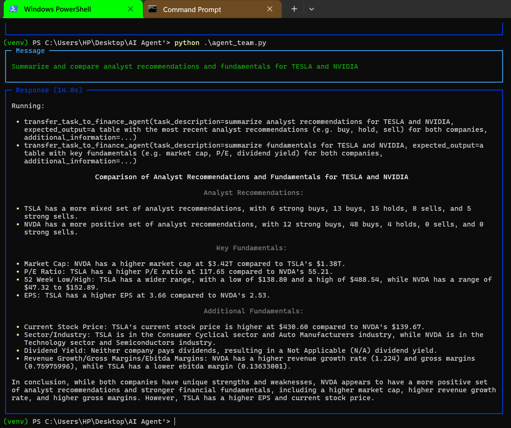

# AI Agent for Search Query

The <b>AI Agent for Search Query</b> is a powerful tool designed to streamline and enhance search experiences. By leveraging advanced Natural Language Processing (NLP) and AI techniques, the agent processes user queries and delivers precise, relevant, and context-aware results. The application is versatile and can be integrated into search engines, knowledge bases, e-commerce platforms, and more.
<br>
<b>Installation</b>

Prerequisites

```bash
Python 3.10.7 or higher

Virtual environment tool 

Required dependencies (listed in requirements.txt)
```
<ol>
<li>Steps</li>
Clone the repository:

```bash
git clone https://github.com/Bikas0/AI-Agent-for-Search-Query.git
cd ai-agent-for-search-query
```
<li>Create and activate a virtual environment</li>

```bash
python3 -m venv venv
source venv/bin/activate
       or
conda create -p venv python=3.10.7
conda activate ./venv
```
<li>Install dependencies:</li>

```bash
pip install -r requirements.txt
```

<li>Run the application</li>

```bash
python agent_team.py
        or
python agent.py
```
</ol>


<h3>Usage</h3>

<b>Query Input</b>

Provide input queries in natural language (e.g., "Summarize and compare analyst recommendations and fundamentals for TESLA and NVIDIA").

<b>Response Output</b>



<b>License</b>

This project is licensed under the MIT License. See the LICENSE file for details.

<b>Contact</b>

For questions or support, please contact:

- **Email:** [bikasictiu1718@gmail.com](mailto:bikasictiu1718@gmail.com)
- **Portfolio:** [Portfolio](https://bikas0.github.io/)

